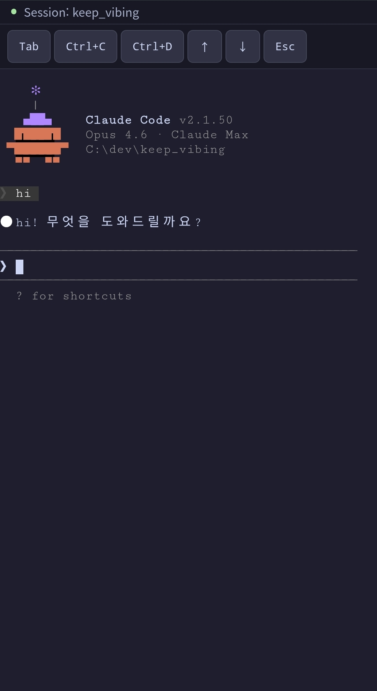

# keep_vibing

A web-based interface for accessing Claude Code development environments from any browser on your local network.

## Screenshot


## Tech Stack

| Layer | Stack |
|-------|-------|
| Backend | FastAPI, WebSocket, Python 3.13 (Windows / macOS / Linux) |
| Frontend | React, Vite, Monaco Editor, xterm.js |
| Auth | JWT (bcrypt + PyJWT) |
| Package | uv (Backend), npm (Frontend) |

## Features

- **JWT Authentication** — Protects local PC access; account locks after 5 failed attempts with automatic server shutdown
- **Project Management** — Add/remove directory-based projects
- **File Explorer** — Tree view with create, delete, rename, copy/cut/paste via context menu
- **Code Editor** — Monaco Editor with tab management, syntax highlighting, Markdown/image viewer
- **Claude Code Terminal** — Runs claude CLI as a subprocess, pipes stdin/stdout over WebSocket with real-time PTY resize
- **Cross-Device Session Sharing** — Switch from PC to mobile seamlessly; existing terminal history is preserved with multi-client support
- **Mobile Support** — Responsive layout for smartphones and tablets with touch-optimized controls
- **Theming** — Switch between dark/light themes

## Getting Started

### Prerequisites

- Python 3.13+
- Node.js 18+
- [uv](https://docs.astral.sh/uv/)
- [Claude Code CLI](https://docs.anthropic.com/en/docs/claude-code)

**Supported platforms**: Windows, macOS, Linux

### Installation

```bash
git clone https://github.com/karrdy89/keep_vibing.git
cd keep_vibing

# Install backend dependencies
uv sync

# Install frontend dependencies
cd frontend && npm install
```

### Run

```bash
uv run python start.py
```

This starts both the backend (`:8000`) and frontend (`:11000`).
Open `http://localhost:11000` in your browser.

Default credentials: `admin` / `admin`

> **Security note**: The account locks after 5 failed login attempts and the server shuts down automatically. To unlock, remove `"locked": true` from `data/users.json`.

## Remote Access

Since keep_vibing runs on your local PC, additional setup is required to access it from external networks (smartphone, another PC, etc.).

### Option 1: ngrok (easiest)

```bash
ngrok http 11000
```

Access from anywhere using the URL provided by ngrok.

### Option 2: Port Forwarding

Forward an external port to your local PC's port `11000` in your router settings.

1. Open your router admin page (usually `192.168.0.1`)
2. Add a port forwarding rule: external port → internal IP:11000
3. Access via `http://<public-IP>:<external-port>`

### Option 3: Tailscale / Cloudflare Tunnel

Secure VPN-based access without exposing your public IP.

> **Warning**: Always change the default password (`admin`) before enabling remote access. You can change it in the Settings panel.

## Mobile Support



Three-tier responsive layout for all devices:

| Screen Size | Layout |
|-------------|--------|
| < 640px (phone) | Bottom tab bar for Files/Editor/Terminal, special key toolbar |
| 640–1023px (tablet) | Overlay sidebar + vertical editor/terminal split |
| >= 1024px (desktop) | Sidebar + Editor + Terminal 3-panel |

Code editor is read-only on smartphones. Use a desktop or tablet for editing.

## Project Structure

```
keep_vibing/
├── backend/
│   ├── app.py               # FastAPI entry point
│   ├── api.py               # REST API router
│   ├── ws.py                # WebSocket router
│   ├── auth.py              # JWT authentication
│   ├── session_manager.py   # Claude CLI session management (output buffering, multi-client)
│   ├── store.py             # Project/settings persistence
│   └── tests/               # Backend tests
├── frontend/
│   ├── src/
│   │   ├── App.tsx           # Main layout
│   │   ├── api.ts            # API client
│   │   ├── Terminal.tsx      # xterm.js terminal
│   │   ├── themes.ts         # Theme definitions
│   │   └── components/       # UI components
│   └── vite.config.ts
├── start.py                  # Dev server launch script
└── pyproject.toml
```

## License

[MIT](LICENSE)
