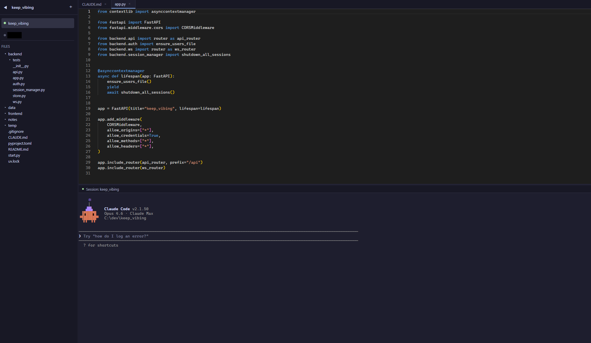

# keep_vibing

로컬 PC에서 웹 서버를 띄워 브라우저로 Claude Code 개발환경에 접속하는 서비스

## Screenshot



## Tech Stack

| Layer | Stack |
|-------|-------|
| Backend | FastAPI, WebSocket, Python 3.13 (Windows / macOS / Linux) |
| Frontend | React, Vite, Monaco Editor, xterm.js |
| Auth | JWT (bcrypt + PyJWT) |
| Package | uv (Backend), npm (Frontend) |

## Features

- **JWT 로그인** - 로컬 PC 제어 권한 보호, 5회 실패 시 계정 잠금 + 서버 자동 종료
- **프로젝트 관리** - 디렉터리 기반 프로젝트 추가/삭제
- **파일 탐색기** - 트리 뷰, 파일/폴더 생성·삭제·이름변경, 컨텍스트 메뉴
- **코드 에디터** - Monaco Editor 기반, 탭 관리, 구문 강조, Markdown/이미지 뷰어
- **Claude Code 터미널** - claude CLI를 subprocess로 실행, stdin/stdout을 WebSocket으로 연결, 실시간 PTY 리사이즈
- **모바일 지원** - 스마트폰/태블릿 반응형 레이아웃, 터치 최적화
- **테마 설정** - 다크/라이트 등 테마 전환

## Getting Started

### Prerequisites

- Python 3.13+
- Node.js 18+
- [uv](https://docs.astral.sh/uv/)
- [Claude Code CLI](https://docs.anthropic.com/en/docs/claude-code)

**지원 플랫폼**: Windows, macOS, Linux

### Installation

```bash
# 저장소 클론
git clone https://github.com/karrdy89/keep_vibing.git
cd keep_vibing

# Backend 의존성 설치 (FastAPI, uvicorn, PyJWT, bcrypt 등)
uv sync

# Frontend 의존성 설치 (React, Monaco Editor, xterm.js, marked 등)
cd frontend && npm install
```

### Run

```bash
uv run python start.py
```

Backend(`:8000`)과 Frontend(`:11000`)가 동시에 실행됩니다.
브라우저에서 `http://localhost:11000`으로 접속하세요.

기본 계정: `admin` / `admin`

> **보안 주의**: 로그인 5회 실패 시 계정이 잠기고 서버가 자동 종료됩니다. 잠금 해제는 `data/users.json`에서 `"locked": true`를 삭제하세요.

## 외부 접속 (Remote Access)

keep_vibing은 로컬 PC에서 실행되므로, 외부 네트워크(스마트폰, 다른 PC 등)에서 접속하려면 별도 설정이 필요합니다.

### 방법 1: ngrok (간편)

```bash
# ngrok 설치 후
ngrok http 11000
```

ngrok이 제공하는 URL로 어디서든 접속할 수 있습니다.

### 방법 2: 포트 포워딩

공유기 설정에서 외부 포트를 로컬 PC의 `11000` 포트로 포워딩하세요.

1. 공유기 관리 페이지 접속 (보통 `192.168.0.1`)
2. 포트 포워딩 설정에서 외부 포트 → 내부 IP:11000 매핑
3. `http://<공인IP>:<외부포트>`로 접속

### 방법 3: Tailscale / Cloudflare Tunnel

VPN 기반으로 안전하게 접속할 수 있습니다. 공인 IP 노출 없이 사용 가능합니다.

> **주의**: 외부 접속 시 반드시 기본 비밀번호(`admin`)를 변경하세요. 설정 패널에서 비밀번호를 변경할 수 있습니다.

## 모바일 지원

3단계 반응형 레이아웃으로 모든 기기에서 사용할 수 있습니다.

| 화면 크기 | 레이아웃 |
|-----------|----------|
| < 640px (스마트폰) | 하단 탭바로 Files/Editor/Terminal 전환, 터미널 특수키 툴바 |
| 640~1023px (태블릿) | 오버레이 사이드바 + 에디터/터미널 세로 분할 |
| >= 1024px (데스크탑) | 사이드바 + 에디터 + 터미널 3패널 |

스마트폰에서는 코드 에디터가 읽기 전용으로 표시됩니다. 코드 편집은 데스크탑 또는 태블릿에서 이용하세요.

## Project Structure

```
keep_vibing/
├── backend/
│   ├── app.py               # FastAPI 앱 진입점
│   ├── api.py               # REST API 라우터
│   ├── ws.py                # WebSocket 라우터
│   ├── auth.py              # JWT 인증
│   ├── session_manager.py   # Claude CLI 세션 관리
│   ├── store.py             # 프로젝트/설정 영속 저장
│   └── tests/               # 백엔드 테스트
├── frontend/
│   ├── src/
│   │   ├── App.tsx           # 메인 레이아웃
│   │   ├── api.ts            # API 클라이언트
│   │   ├── Terminal.tsx      # xterm.js 터미널
│   │   ├── themes.ts         # 테마 정의
│   │   └── components/       # UI 컴포넌트
│   └── vite.config.ts
├── start.py                  # 개발 서버 실행 스크립트
└── pyproject.toml
```
